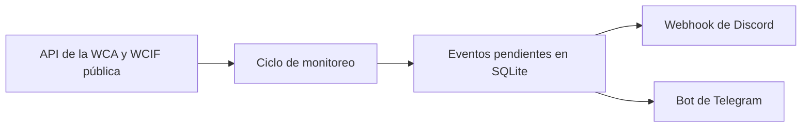

# Monitor de competencias WCA

[English](README.md) · [Español](README.es.md)

Este proyecto monitorea las próximas competencias de la World Cube Association y avisa por Discord, Telegram o ambos cuando hay algo importante: una competencia nueva, una inscripción que está por abrir, una inscripción abierta o pocos cupos disponibles.

## Contexto

Yo como speedcuber, participaba en competencias, pero cuando entré a la universidad ya no tenía tanto tiempo para revisar la página de la WCA. A veces me enteraba tarde de una competencia o, cuando intentaba inscribirme, los cupos ya estaban llenos.

La primera solución fue [`wca-bot`](https://github.com/Irenko85/wca-bot), un bot de Discord que hice en 2023. Con el tiempo fui separando el monitoreo del bot y este repositorio terminó convirtiéndose en el proyecto actual.

Lo uso para seguir las competencias de Chile, pero dejé configurables el país, la zona horaria, el idioma y los parámetros de las alertas para que también se pueda usar en otros países.

## ¿Qué hace?

- Avisa cuando aparece una competencia nueva en la WCA.
- Avisa poco antes de que abra una inscripción.
- Notifica cuando la inscripción ya abrió.
- Revisa cuántos competidores fueron aceptados y avisa cuando quedan pocos cupos.
- Puede enviar mensajes por Discord, Telegram o ambos.
- Los mensajes pueden estar en español o inglés.
- Guarda el estado en SQLite para no repetir alertas.
- Si un canal falla, lo reintenta sin volver a enviar el mensaje al canal que ya funcionó.
- Se puede ejecutar con Docker en un servidor propio.

## Cómo funciona



Antes de enviar una alerta, el monitor la guarda en una db SQLite. Discord y Telegram tienen registros de entrega separados, así que un problema en uno de los canales no provoca mensajes duplicados en el otro.

## Inicio rápido con Docker

Necesario:

- Docker Engine con Docker Compose.
- Un webhook de Discord, las credenciales de un bot de Telegram o ambos.

```bash
git clone https://github.com/Irenko85/wca-dc-webhook.git
cd wca-dc-webhook
cp .env.example .env
```

Editar `.env`, desactivar los canales que no vayas a usar y agrega las credenciales correspondientes. Después levantar el monitor con:

```bash
mkdir -p data
docker compose up -d --build
docker compose logs -f
```

La base de datos queda en `./data/wca_tracker.sqlite3`, por lo que el estado se mantiene aunque se vuelva a crear el contenedor.

## Configuración

| Variable | Valor predeterminado | Para qué sirve |
|---|---:|---|
| `WCA_COUNTRY_ISO2` | `CL` | Código ISO2 del país que se consultará en la WCA. |
| `TZ` | `America/Santiago` | Zona horaria usada para las fechas y los logs. |
| `NOTIFICATION_LANGUAGE` | `es` | Idioma de los mensajes: `es` o `en`. |
| `POLL_INTERVAL_SECONDS` | `3600` | Tiempo de espera entre cada revisión. |
| `REGISTRATION_UPCOMING_MINUTES` | `90` | Cuánto antes se avisa que una inscripción está por abrir. |
| `REGISTRATION_OPEN_GRACE_MINUTES` | `90` | Ventana para detectar una inscripción recién abierta; debe ser mayor que el intervalo de monitoreo. |
| `SPOTS_WARNING_PERCENT` | `0.80` | Porcentaje de cupos ocupados que activa la alerta. |
| `REQUEST_TIMEOUT_SECONDS` | `10` | Tiempo máximo de espera para las solicitudes HTTP. |
| `DB_PATH` | `data/wca_tracker.sqlite3` | Ruta de la base de datos. En Docker se usa `/app/data/wca_tracker.sqlite3`. |
| `DISCORD_ENABLED` | inferido | Permite activar o desactivar Discord. |
| `DISCORD_WEBHOOK_URL` | - | URL del webhook de Discord. |
| `TELEGRAM_ENABLED` | inferido | Permite activar o desactivar Telegram. |
| `TELEGRAM_BOT_TOKEN` | - | Token del bot de Telegram. |
| `TELEGRAM_CHANNEL_ID` | - | ID del chat o canal donde se enviarán los mensajes. |

Si no se define `DISCORD_ENABLED` o `TELEGRAM_ENABLED`, el monitor intenta habilitar el canal cuando encuentra todas las credenciales.

### Ejemplo: Nueva Zelanda con mensajes en inglés

```dotenv
WCA_COUNTRY_ISO2=NZ
TZ=Pacific/Auckland
NOTIFICATION_LANGUAGE=en
DISCORD_ENABLED=true
DISCORD_WEBHOOK_URL=https://discord.com/api/webhooks/...
TELEGRAM_ENABLED=false
```

## Desarrollo local

Se necesita Python 3.12 o una versión más reciente.

```bash
python -m venv .venv
source .venv/bin/activate
python -m pip install -e ".[dev]"
python -m pytest -v
python -m ruff check .
python -m ruff format --check .
```

Para ejecutar el monitor fuera de Docker, crear el archivo `.env` y usar:

```bash
python -m wca_notifier
```

## Estructura del proyecto

```text
src/wca_notifier/
├── config.py          # Configuración y validaciones
├── detection.py       # Detección de los eventos
├── events.py          # Modelo de las notificaciones
├── repository.py      # Estado SQLite y entregas pendientes
├── monitor.py         # Ejecución de un ciclo de monitoreo
├── wca_client.py      # Consultas a la WCA y WCIF pública
├── i18n.py            # Carga de los mensajes traducidos
├── locales/           # Mensajes en inglés y español
└── notifications/     # Envío y formato para Discord y Telegram
```

## Actualización desde la versión anterior

El monitor sigue usando la base de datos SQLite existente. Al iniciar, convierte el seguimiento anterior de inscripciones y cupos al formato nuevo para evitar que se vuelvan a enviar alertas antiguas.

Los archivos JSON que usaba la versión ejecutada mediante GitHub Actions ya no son necesarios. El estado actual se guarda dentro de `data/` y no debe subirse al repositorio.

## Historia

El proyecto comenzó con [`wca-bot`](https://github.com/Irenko85/wca-bot), un bot de Discord que hice en 2023 para consultar competencias y detectar eventos nuevos.

En 2025 separé el monitor en este repositorio. Al principio se ejecutaba con GitHub Actions y guardaba el estado en archivos JSON. Después lo fui migrando a Docker y SQLite, y agregué Telegram, alertas de inscripción, seguimiento de cupos, mensajes traducidos y reintentos separados por canal.

## Pendiente

- Agregar mensajes en portugués.
- Permitir otros canales de notificación sin tener que cambiar el monitor.

## Licencia

El proyecto está publicado bajo la [licencia MIT](LICENSE).

Este proyecto no está afiliado ni respaldado por la World Cube Association.
