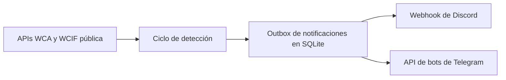

# Monitor de competencias WCA

[English](README.md) · [Español](README.es.md)

Monitor configurable y autoalojado que observa las próximas competencias de la World Cube Association y envía notificaciones oportunas por Discord y Telegram.

El proyecto nació de un problema personal. Antes competía como speedcuber, pero al entrar a la universidad dejé de tener tiempo para revisar regularmente el sitio de la WCA. Más de una vez encontré una competencia cuando las inscripciones ya estaban completas. Construí este monitor para recibir directamente los anuncios de competencias, aperturas de registro y alertas de pocos cupos.

Chile es la configuración predeterminada y el caso de uso original, pero se puede configurar cualquier código ISO2 aceptado por la WCA.

## Funcionalidades

- Detecta competencias WCA recién anunciadas.
- Avisa poco antes de que abra una inscripción.
- Notifica cuando la inscripción ya está abierta.
- Advierte cuando los inscritos aceptados alcanzan un umbral configurable.
- Envía notificaciones a Discord, Telegram o ambos.
- Admite notificaciones en español e inglés.
- Persiste el estado y las entregas por canal en SQLite.
- Reintenta un canal fallido sin repetir la notificación en los canales exitosos.
- Se ejecuta como contenedor Docker endurecido y con healthcheck.

## Cómo funciona



Cada evento se guarda antes de intentar entregarlo. Discord y Telegram mantienen registros independientes, por lo que una caída parcial puede reintentarse sin duplicar mensajes en el canal que ya funcionó.

## Inicio rápido con Docker

Requisitos:

- Docker Engine con Docker Compose
- Un webhook de Discord, credenciales de un bot de Telegram o ambos

```bash
git clone https://github.com/Irenko85/wca-dc-webhook.git
cd wca-dc-webhook
cp .env.example .env
```

Edita `.env`, deshabilita los canales que no usarás y reemplaza las credenciales de ejemplo. Luego inicia el monitor:

```bash
mkdir -p data
docker compose up -d --build
docker compose logs -f
```

El estado SQLite queda en `./data/wca_tracker.sqlite3` y persiste al recrear el contenedor.

## Configuración

| Variable | Predeterminado | Descripción |
|---|---:|---|
| `WCA_COUNTRY_ISO2` | `CL` | Código de país de dos letras usado por la API de la WCA. |
| `TZ` | `America/Santiago` | Zona horaria IANA para fechas locales y logs. |
| `NOTIFICATION_LANGUAGE` | `es` | Idioma de notificaciones: `es` o `en`. |
| `POLL_INTERVAL_SECONDS` | `3600` | Espera entre ciclos de monitoreo. |
| `REGISTRATION_UPCOMING_MINUTES` | `90` | Anticipación para el recordatorio de inscripción. |
| `REGISTRATION_OPEN_GRACE_MINUTES` | `90` | Ventana de alerta; debe superar el intervalo de monitoreo. |
| `SPOTS_WARNING_PERCENT` | `0.80` | Proporción que activa la alerta de pocos cupos. |
| `REQUEST_TIMEOUT_SECONDS` | `10` | Timeout de solicitudes HTTP. |
| `DB_PATH` | `data/wca_tracker.sqlite3` | Ruta del estado SQLite. Docker usa `/app/data/wca_tracker.sqlite3`. |
| `DISCORD_ENABLED` | inferido | Habilita o deshabilita Discord explícitamente. |
| `DISCORD_WEBHOOK_URL` | — | URL del webhook de Discord. |
| `TELEGRAM_ENABLED` | inferido | Habilita o deshabilita Telegram explícitamente. |
| `TELEGRAM_BOT_TOKEN` | — | Token del bot de Telegram. |
| `TELEGRAM_CHANNEL_ID` | — | ID del chat o canal de destino. |

Por compatibilidad, un canal se habilita automáticamente si sus credenciales completas están presentes y se omite su flag explícito.

### Ejemplo: Nueva Zelanda con mensajes en inglés

```dotenv
WCA_COUNTRY_ISO2=NZ
TZ=Pacific/Auckland
NOTIFICATION_LANGUAGE=en
DISCORD_ENABLED=true
DISCORD_WEBHOOK_URL=https://discord.com/api/webhooks/...
TELEGRAM_ENABLED=false
```

## Desarrollo local

Se requiere Python 3.12 o superior.

```bash
python -m venv .venv
source .venv/bin/activate
python -m pip install -e ".[dev]"
python -m pytest -v
python -m ruff check .
python -m ruff format --check .
```

Para ejecutar localmente, crea `.env` y usa:

```bash
python -m wca_notifier
```

## Estructura

```text
src/wca_notifier/
├── config.py          # Configuración validada
├── detection.py       # Detección pura de eventos
├── events.py          # Modelo de eventos
├── repository.py      # Estado SQLite y outbox de entregas
├── monitor.py         # Interfaz de un ciclo de monitoreo
├── wca_client.py      # Adapter de WCA y WCIF pública
├── i18n.py            # Carga de catálogos
├── locales/           # Catálogos en inglés y español
└── notifications/     # Adapters y formato para Discord y Telegram
```

## Actualización desde la versión anterior

La base SQLite actual se reutiliza. Al iniciar, el tracking heredado de registros y cupos se migra a entregas completadas por canal, evitando que se vuelvan a enviar alertas antiguas.

Los JSON que usaba la versión ejecutada mediante GitHub Actions dejaron de utilizarse. El estado de ejecución pertenece a `data/` y no debe versionarse.

## Historia

La primera versión fue [`wca-bot`](https://github.com/Irenko85/wca-bot), un bot de Discord creado en 2023. Permitía consultar competencias mediante comandos y revisaba periódicamente la aparición de eventos nuevos.

Este repositorio se convirtió en el monitor independiente durante 2025. Evolucionó desde una GitHub Action programada con estado JSON hacia un proceso Docker autoalojado con SQLite, Telegram, alertas de inscripción, detección de pocos cupos, mensajes bilingües y reintentos confiables por canal.

## Roadmap

- Agregar notificaciones en portugués.
- Incorporar capturas sanitizadas de las notificaciones.
- Permitir adapters adicionales sin ampliar la interfaz del monitor.

Este proyecto no está afiliado ni respaldado por la World Cube Association.
