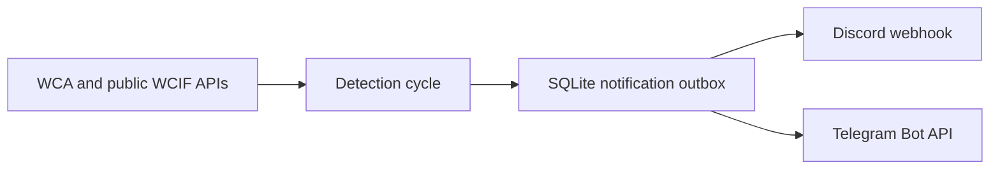

# WCA Competition Monitor

[English](README.md) · [Español](README.es.md)

A configurable, self-hosted monitor that watches upcoming World Cube Association competitions and sends timely Discord and Telegram notifications.

The project was born from a personal problem. I used to compete in speedcubing, but after starting university I no longer had enough time to check the WCA website regularly. More than once, I found a competition only after registration had filled up. I built this monitor so that new competitions, registration windows, and limited spots would reach me instead.

Chile is the default configuration and the original use case, but any WCA country ISO2 code can be configured.

## Features

- Detects newly announced WCA competitions.
- Warns shortly before registration opens.
- Announces when registration has opened.
- Warns when accepted registrations reach a configurable capacity threshold.
- Sends notifications to Discord, Telegram, or both.
- Supports English and Spanish notifications.
- Persists state and per-channel deliveries in SQLite.
- Retries a failed channel without repeating notifications on channels that already succeeded.
- Runs as a hardened, health-checked Docker container.

## How it works



Each event is stored before delivery. Discord and Telegram have independent delivery records, so a partial outage remains retryable without producing duplicates on the successful channel.

## Quick start with Docker

Requirements:

- Docker Engine with Docker Compose
- A Discord webhook, Telegram bot credentials, or both

```bash
git clone https://github.com/Irenko85/wca-dc-webhook.git
cd wca-dc-webhook
cp .env.example .env
```

Edit `.env`, disable any unused channel, and replace the example credentials. Then start the monitor:

```bash
mkdir -p data
docker compose up -d --build
docker compose logs -f
```

SQLite state is stored in `./data/wca_tracker.sqlite3` and survives container recreation.

## Configuration

| Variable | Default | Description |
|---|---:|---|
| `WCA_COUNTRY_ISO2` | `CL` | Two-letter country code used by the WCA API. |
| `TZ` | `America/Santiago` | IANA timezone used for local dates and logs. |
| `NOTIFICATION_LANGUAGE` | `es` | Notification language: `es` or `en`. |
| `POLL_INTERVAL_SECONDS` | `3600` | Delay between monitoring cycles. |
| `REGISTRATION_UPCOMING_MINUTES` | `90` | Advance window for the registration reminder. |
| `REGISTRATION_OPEN_GRACE_MINUTES` | `90` | Open-alert window; it must be longer than the polling interval. |
| `SPOTS_WARNING_PERCENT` | `0.80` | Capacity ratio that triggers the limited-spots alert. |
| `REQUEST_TIMEOUT_SECONDS` | `10` | HTTP request timeout. |
| `DB_PATH` | `data/wca_tracker.sqlite3` | SQLite state path. Docker uses `/app/data/wca_tracker.sqlite3`. |
| `DISCORD_ENABLED` | inferred | Enables or disables Discord explicitly. |
| `DISCORD_WEBHOOK_URL` | — | Discord webhook URL. |
| `TELEGRAM_ENABLED` | inferred | Enables or disables Telegram explicitly. |
| `TELEGRAM_BOT_TOKEN` | — | Telegram bot token. |
| `TELEGRAM_CHANNEL_ID` | — | Telegram destination chat or channel ID. |

For backward compatibility, a channel is automatically enabled when its complete credentials are present and its explicit flag is omitted.

### Example: New Zealand with English notifications

```dotenv
WCA_COUNTRY_ISO2=NZ
TZ=Pacific/Auckland
NOTIFICATION_LANGUAGE=en
DISCORD_ENABLED=true
DISCORD_WEBHOOK_URL=https://discord.com/api/webhooks/...
TELEGRAM_ENABLED=false
```

## Local development

Python 3.12 or newer is required.

```bash
python -m venv .venv
source .venv/bin/activate
python -m pip install -e ".[dev]"
python -m pytest -v
python -m ruff check .
python -m ruff format --check .
```

To run the monitor locally, create `.env` and execute:

```bash
python -m wca_notifier
```

## Project structure

```text
src/wca_notifier/
├── config.py          # Validated runtime settings
├── detection.py       # Pure event detection
├── events.py          # Notification event model
├── repository.py      # SQLite state and delivery outbox
├── monitor.py         # One monitoring-cycle interface
├── wca_client.py      # WCA and public WCIF adapter
├── i18n.py            # Message catalog loader
├── locales/           # English and Spanish catalogs
└── notifications/     # Discord, Telegram, and formatting adapters
```

## Upgrade from the previous version

The current SQLite database is reused. Legacy registration and spots tracking is migrated into completed per-channel deliveries during startup, preventing old alerts from being sent again after upgrading.

The JSON files previously committed by the GitHub Actions version are no longer used. Runtime state belongs in `data/` and must not be committed.

## History

The first version was [`wca-bot`](https://github.com/Irenko85/wca-bot), a Discord bot created in 2023. It offered commands for browsing competitions and periodically checked for new events.

This repository became the independent monitor in 2025. It evolved from a scheduled GitHub Action with JSON state into a self-hosted Docker process with SQLite, Telegram support, registration alerts, limited-spots detection, bilingual messages, and reliable per-channel retries.

## Roadmap

- Add Portuguese notifications.
- Support additional delivery adapters without expanding the monitoring interface.

## License

Released under the [MIT License](LICENSE).

This project is not affiliated with or endorsed by the World Cube Association.
